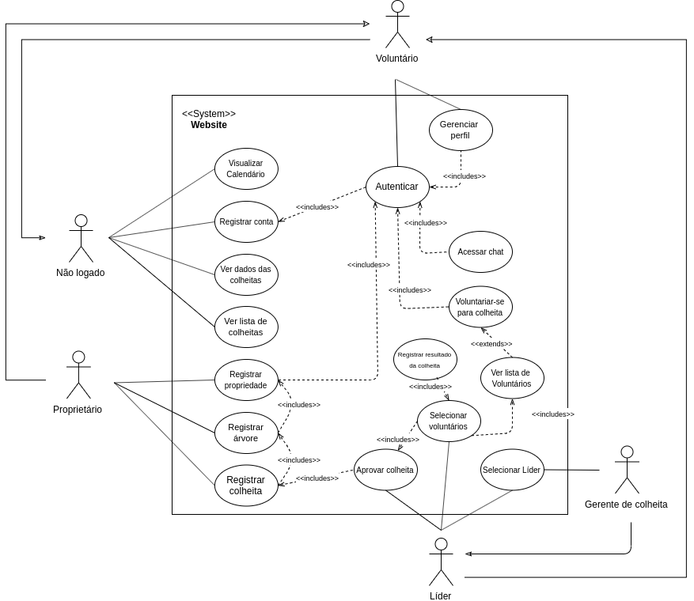
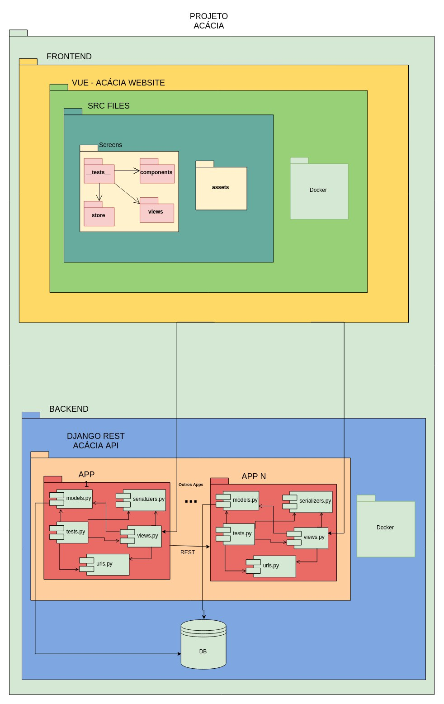
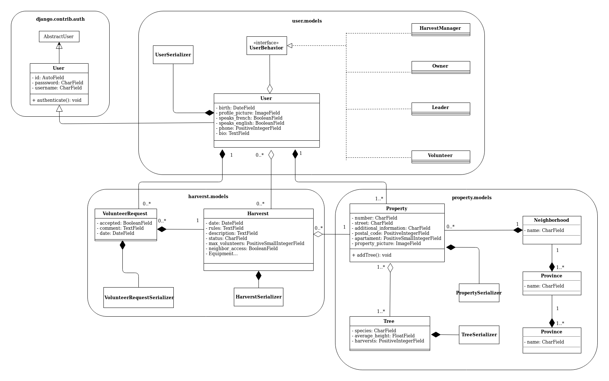

# Documento de arquitetura

## Histórico de revisão
| Data   | Versão | Modificação  | Autor  |
| :- | :- | :- | :- |
| 10/09/2019 | 0.1 | Adição do tópico Objetivo |  Durval Carvalho |
| 10/09/2019 | 0.2 | Adição do tópico Escopo e Django REST Framework |  Durval Carvalho |
| 11/09/2019 | 0.3 | Adição do tópico Metas e Restrições arquiteturais |  Durval Carvalho |
| 12/09/2019 | 0.4 | Adição de tópico Casos de Uso | Renato Britto Araújo |
| 12/09/2019 | 0.5 | Adição do tópico MTV |  Durval Carvalho |
| 12/09/2019 | 0.6 | Adição de diagrama de pacotes back-end e informações sobre base de dados | Renato Britto Araujo | 
| 12/09/2019 | 0.7 | Adição de diagrama de pacotes front-end e referências e comentário sobre MTV | Renato Britto Araujo |
| 12/09/2019 | 0.8 | Adição do tópico Banco de Dados |  Durval Carvalho |
| 12/09/2019 | 0.9 | Adição do informação sobre o super usuário |  Durval Carvalho |
| 12/09/2019 | 0.10 | Adição do tópico Vue.js | João Pedro Silva de Carvalho |
| 12/09/2019 | 0.11 | Adição do tópico Diagrama de classes e serviços | Flavio Vieira |
| 12/09/2019 | 0.12 | Adição do link da imagem do diagrama e organização do tópico  | Flavio Vieira |
| 14/09/2019 | 1.0 | Adição do tópico 	 | Durval Carvalho |
| 17/09/2019 | 1.1 | Ajuste do diagrama de casa de uso | Flavio Vieira e Leonardo da Silva Gomes |
| 19/09/2019 | 1.2 | Adição de nova versão do diagrama de pacotes | Durval Carvalho e João Pedro |
| 19/09/2019 | 1.3 | Ajuste do diagrama de classes | Hugo Sobral e Renato Britto |
| 20/09/2019 | 1.4 | Ajuste dos diagramas de banco  | Flavio Vieira |
| 01/10/2019 | 1.5 | Refatoração dos requisitos do projeto  | Durval Carvalho |

## 1. Introdução

### 1.1 Objetivo
Este documento oferece uma visão geral arquitetural do 
sitema que será implementado, permitindo assim que os 
envolvidos no projeto conheça como a aplicação será 
subdivida e quais será a função de cada componente.

Outro objetivo desse documento é elucidar quais foram as 
motivações que levaram a equipe a tomar decisões à respeito
dessa arquitetura.

### 1.2 Escopo

Esse documento aplica-se ao projeto <Nome do Projeto>, um 
sistema que será desenvolvido pelos alunos das disciplinas 
Métodos de Desenvolvimento de Software e Engenharia de 
Produto de Software, da Universidade de Brasília - Campus 
Gama.

### 1.3 Definições, Acrônimos e Abreviações

| **Sigla/Termo/Acrônimo** | **Definição** |
| ------------------------ | ------------- |
| MDS | Métodos de Desenvolvimento de <i>Software</i> | 
| EPS | Engenharia de Produto de <i>Software</i> | 
| FGA | Faculdade do Gama | 
| UnB | Universidade de Brasília | 
| DRF | Django Rest Framework |
| MTV | Model Template View |
| MVC | Model View Controller |
| RF  | Requisito Funcional |
| RNF | Requisito Não Funcional |

## 2. Representação arquitetural

### 2.1 Django REST Framework

O Django REST Framework é uma biblioteca para o Framework 
Django que disponibiliza funcionalidades para implementar 
APIs Rest de forma rápida e eficiente.

REST é a abreviação do termo <i>Representational State 
Transfer</i>, isto é, um conjunto de princípios e boas 
práticas desenvolvido pelo pesquisador Roy Fielding, que 
quando aplicados permite uma interface concisa que pode 
ser utilizado por diversas outras aplicações.

Como explicado acima o DRF é um framework do framework 
Django. Então primeiro explicaremos o motivo de termos 
escolhido Django para o back-end desse projeto.

#### 2.2.1 Django

O Django é um framework web criado com a linguagem Python, que 
utiliza o padrão model-template-view. Esse modelo MTV é basedo 
no modelo Model-View-Controler, com a diferença que as 
responsabilidades do módulo de Controller está dispersa no 
próprio Framework.

Outro motivo do uso do Django é sua robustez. O framework 
possui diversos módulos embutidos que aumenta a 
produtividade da equipe no decorrer do projeto. Os 2 
principais módulos que pode ser citado é o 
Mapeador objeto-relacional (OMR) que irá facilitar a vida 
dos desenvolvedores que não tiverem afinidade em SQL, e o 
painel administrativo que irá de forma visual criar, 
deletar, editar e visualizar objetos do banco de dados.

#### 2.2.2 Modelo MTV

A **Model** é a camada de acesso dos dados. Nessa camada contém 
as classes que abstraem os dados, as lógicas de validação, de 
filtro e de acesso.

O **View** é a camada da regras de negócios. Nessa camada será 
implementada as restrições, o que um usuário pode ou não pode 
fazer, e quais páginas eles tem acesso. É através dessa camada 
que as requisições do usuário será gerenciada.

Essa camada implementa algumas funções do Controller do padrão 
MVC, porém o MTV se diferencia de MVC por ser mais permissivo
quanto a comunicação entre diferentes partes do software 
[[1]](##referências).

O **Template** é a camada de apresentação. Os templates são 
arquivos de texto, que isola os dados do sistema da forma como 
esses dados serão apresentados. O formato mais comum é o HTML.

#### 2.2.3 Django REST
Assim contextualizado, podemos falar sobre o Django REST.
O Django REST possui diversos módulos embutidos que 
facilita a implementação dos princípios e boas práticas 
da arquitetura REST. 

Um exemplo de facilidade é o fato de por padrão as rotas 
dos recursos selecionados serem codificadas para 
respeitar o padrão da arquitetura REST, assim não sendo 
necessário escrever todas as 7 rotas do REST (index, new, 
create, show, edit, update e destroy).

### 2.2 Vue.js
O Vue.js é um framework para a criação de interfaces para o 
usuário. O Vue.js, desde a sua concepção, busca ser simples e 
objetivo, o que o torna com uma baixa curva de aprendizagem, ou 
seja, demora-se menos tempo para uma equipe aprender o Vue.js do 
que outros frameworks. Além disso, o Vue.js, diferentemente do 
Angular.js (mantido pela Google) e do React.js (mantido pelo 
Facebook), possui uma comunidade como sua mantenedora o que 
permite uma maior interação entre as pessoas que usam e as quem 
desenvolve esse framework que são beneficiados com mais feedbacks 
possibilitando melhores atualizações.

Os componentes do Vue.js são uma ferramenta importante. 
O funcionamento dele se baseia que o desenvolvedor pode separar a 
página em componentes quem possuem, cada um, seu próprio código em 
JavaScript, HTML e CSS, permitindo assim a reutilização dessas 
estruturas em outras partes da aplicação.

Uma das características mais distintas do Vue é seu sistema de 
reatividade não obstrusivo. Os modelos dados são simplesmente 
objetos JavaScript puros e quando você os modifica, a camada 
visual se atualiza. Isto torna o gerenciamento de estado simples e 
intuitivo. Em comparação com o JavaScript puro ou até mesmo o 
jQuery, utilizar a reatividade do Vue é bem mais simples.

## 3. Metas e Restrições arquiteturais

3.1 **Suportabilidade**

A aplicação poderá ser utilizada sem grandes problemas 
pelos principais navegadores modernos da atualizada, no 
entanto o enfoque será para o Google Chrome, tanto sua 
versão desktop quanto sua versão mobile, e o Safari, 
navegador padrão dos sistemas da Apple.

3.2 **Usabilidade**

O sistema deverá ser intuitivo e de simples uso, de forma 
que a curva de aprendizado para utilizar a aplicação não 
seja um impedimento para usar o sistema.

3.3 **Ferramentas de Desenvolvimento**

O projeto será desenvolvido em Python (versão 3.7), 
utilizando o framework Django (versão 2.2), em conjunto 
com o framework Vue, um framework JavaScript para criação 
de interfaces e aplicativos. 

Para facilitar a portabilidade do projeto, tanto para o 
ambiente de deploy quanto para os ambientes de 
desenvolvimento, será utilizado o <i>Docker</i> para 
realizar o empacotamento da aplicação.

3.4 **Confiabilidade**

O sistema terá uma cobertura mínima de testes de 90%, 
buscando garantir que suas funcionalidades foram 
suficientemente testadas.

## 4. Visão de Casos de Uso

Segue a lista de casos de uso:

- Autenticação de usuário
- Criar conta
- Apagar conta
- Atualizar dados da conta
- Visualizar painel do usuário (colheitas inscritas, total já coletado)
- Criar colheitas
- Atualizar dados colheitas
- Apagar colheitas
- Visualizar todas as colheitas registradas
- Selecionar líder para colheitas
- Voluntariar-se para colheita
- Ver lista de voluntários de uma colheita
- Selecionar voluntários para colheita
- Aprovar colheita
- Ver listas de colheitas
- Ver dados de colheitas
- Registrar árvore
- Atualizar dados da árvore
- Apagar árvore
- Registrar propriedade
- Apagar propriedade
- Atualizar dados da propriedade
- Visualizar calendário de eventos
- Registrar resultado da colheita
- Visualizar dados gerais da plataforma

### 4.1 Atores

#### 4.1.1 Não logado

Usuário do sistema que tem acesso as informações da plataforma e das colheitas, 
tendo acesso apenas as visualizações de cada página, não podendo usufruir das 
funcionalidades que a página disponibiliza, sendo assim, um usuário passivo no 
fluxo da aplicação.

#### 4.1.2 Voluntário

Usuário do sistema capaz participar de colheitas por meio da plataforma, que 
também disponibiliza um chat de conversa com seu grupo voluntário, onde o mesmo 
também pode gerenciar seu perfil.

#### 4.1.3 Proprietário

Usuário do sistema com poder de registrar propriedade, árvore e colheita, para 
os voluntários poderem participar. O mesmo é um grande pilar no fluxo de 
funcionamento do site, onde sem suas informações, não haveria colheita. 

#### 4.1.4 Líder

Usuário do sistema capaz de liderar as colheitas e acesso dos voluntários a 
esse processo, ele é o intermédio entre o proprietário e o voluntário.

#### 4.1.5 Gerente de colheita

Usuário do sistema capaz de gerir e supervisionar as atividades dos líderes 
nesse processo.

### 4.2 Diagrama de caso de uso

### 4.3 Prioridade dos casos de uso

Esse diagrama expõe os seguintes requisitos: 

- RF01: Permitir que o usuário crie, edite, faça login e apague sua conta.
- RF02: Permitir que o usuário visualize o histórico de colheitas que participou.
- RF03: Permitir usuários se candidate a uma colheita.
- RF04: Permitir a seleção de usuários inscritos para uma colheita.
- RF05: Mostar a lista de voluntários selecionados para uma colheita.
- RF06: Assegurar a segurança de dados dos usuários.
- RF07: Exibir notificações sobre atualizações nos eventos inscritos pelos usuários.
- RF08: Permitir o cadastro, atualizao e exclusão de árvores, propriedades e colheitas.
- RF09: Permitir a visualização dos dados das árvores, propriedades e colheitas para todos os usuários.
- RF10: Mostrar colheitas registradas, com enfâse às que acontecerão no futuro.
- RF11: Disponibilizar os dados das colheitas para todos os interessados.
- RF12: Mostrar calendários de colheitas.
- RF13: Suporte para principais navegadores web modernos, com enfâse ao ambiente mobile.

- RNF15: O ambiente de produção deve ser configurado de modo que sempre contenha uma versão testada e estável
- RNF16: O ambiente de homologação deve ser configurado de modo que as versões mais recentes sejam testada
- RNF17: A aplicação deve possuir mecanismos que permitem a acessibilidade de diversos grupos de usuários
- RNF18: A aplicação deve possuir mecanismos que internacionalização de modo que a linguagem do site possa ser configurado pelo usuário

## 5. Visão Lógica

### 5.1 Visão Geral

O sistema será desenvolvido utilizando o framework web Django Rest 
em conjunto com o Vue.JS. Esses sistemas irão se comunicar através 
de uma API REST fornecida pelo backend da aplicação.

	

As ações do usuário, tanto em um ambiente desktop quanto no mobile, será 
interpretada pelo Vue.Js como eventos, onde cada evento está associado com 
um <i>Handler</i> que irá dispará uma ação.

Alguma dessas ações poderão ser tratadas no lado do cliente 
(<i>client side</i>), como ações de iteratividade que não precisam de 
comunicação externa.

Já em outras ações será preciso consultar um banco de dados no lado do 
servidor (<i>server side</i>), assim sendo preciso enviar uma solicitação 
(<i>request</i>) para o servidor, utilizado o protocolo de comunicação HTTP e 
respeitando as regras de interface REST.

Uma vez que o servidor receba a solicitação do cliente, será preciso 
interpretar o request com base na URL e no método HTTP utilizado. Essa 
computação é realizada no módulo <i>URL Dispatcher</i>, onde é mapeado 
para <i>endpoint</i> da aplicação com o módulo que possui as informações 
solicitadas.

Quando o app do Django REST está integrado com o Django, essa etapa ocorre 
em duas etapas. Primeiramente o Django verificar se a url requisitada faz 
parte da API que o Django REST fornece, se fizer parte o Django passa o 
controle para o Django REST para que finalize de processar e mapear a 
requisição.

Uma vez que a url já foi mapeada para o módulo que possui as informações 
requisitadas. Esse módulo, geralmente uma classe dos models.py, será 
responsável por utilizar o OMR (Mapeamento objeto-relacional) para mapear
um modelo da aplicação com um modelo do banco de dados. Após o devido 
mapeamento, o banco de dados irá retornar um conjunto de informações que 
será tratada pelo Django REST.

O Django REST já com os dados em mãos, poderá serializar as informações no 
formato padrão da API, geralmente no formato JSON. Essa serialização que é 
responsável por definir uma interface que vários sistemas poderão consumir.

Uma vez que os dados já foram serializados, o Django REST passa o controle 
para o Django, que será reponsável por retornar uma resposta 
(<i>response</i>) para o lado do cliente.

Essa resposta será obtida pelo Vue.js. Agora com os dados requisitados em 
mãos, ele será responsável por criar e fornecer esse dados para que o 
usuário da aplicação. O Vue.js irá montar um template, de acordo com o 
ambiente do usário (mobile ou desktop) e finalmente o usuário irá poder ver 
os dados requisitados. Tudo isso em questões de microsegundos.

### 5.2 Diagrama de pacotes

	

## 6. Visão de implementação

### 6.1 Diagrama de classes e serviços

O diagrama de classe é uma representação estática para descrever 
a arquitetura de um projeto. Tal documento tem como objetivo principal 
documentar, de formar visual, as fases de desenvolvimento do software. 
Ao analisar o diagrama abaixo é possível mapear, de forma clara e objetiva, 
a estrutura do projeto Acácia em nível macro e auxiliar no entendimento
do escopo. Durante o processo de desenvolvimento do documento a Linguagem 
de Modelagem Unificada (UML) foi utilizada. 

Vale ressaltar a existência de dois aspectos que influenciaram diretamente na
concepção do diagrama de classes, estas são as **relações do framework Django 
Rest**, utilizadas para a serialização dos dados das classes, e o **padrão de 
design State**, usado para designar diferentes comportamentos para o usuário da 
aplicação.

Sobre a classe de usuário da aplicação, o grupo de desenvolvimento do projeto
observou na model **User**, já implementada dentro do Django Rest Framework, 
uma oportunidade de utilização de conteúdo pronto e adaptá-lo ao contexto do 
projeto.
Portanto, os usuários do aplicativo Acácia herdam da classe User do Django.

O padrão de design **State** surgiu como uma solução para o problema das 
diferentes permissões, baseadas em diferentes papeis, que um usuário pode 
assumir dentro da aplicação. Considerando que um mesmo usuário pode ser tanto 
um voluntário, quanto um líder e em outro momento ter o comportamento de 
proprietário, a equipe passou a enfrentar a problemática das permissões de um 
mesmo usuário. Desta forma, o State soluciona esta problemática.

Os **serializers** presentes dentro do diagrama possuem a função de tratar as 
informações das models e serializá-las, ou desserializá-las.

### 6.2 Banco de Dados

Para os desenvolvimento do diagrama do banco de dados primeiro foi 
identificado quais seriam as entidades envolvidas no projeto. Após 
identificadas, foram analisado qual os atributos necessários para 
descrever uma instância de cada uma das entidades.

Assim que todas as entidades foram descritas, foi analisado quais 
seriam as relações entre elas, e suas respectivas cardinalidades.

O resultado desse passos são descritos abaixo.

#### 6.2.1 Entidades

* USER
	* VOLUNTEER
	* OWNER
	* ADMINISTRADOR
* PROPERTY
* HARVERST
* TREE

Um ponto a comentar é a relação especificação da entidade usuário.
O usuário representa qualquer perfil que tenha acesso as áreas do 
site que precisa de autenticação.

A especificação foi utilizada para reduzir o número de auto 
relacionamentos, melhorando assim o entendimento do projeto. 

O perfil do admnistrador será o usuário responsável por 
administrar todos os dados do site. Esse será o <i>useruser</i> do 
Django. Ele poderá criar, editar e apagar qualquer dado que 
presente na aplicação.

Uma função importante do admnistrador é aprovar os eventos 
colheitas que os proprietários irão criar. Ele será responsável 
por não permitir que eventos suspeitos apareçam para os 
voluntários. 

Como por exemplo, imagine que um proprietário cadastre uma 
plantação com 10000 árvores e esteja solicitando 10000 voluntários.
Será função do administrador recusar esse evento.

Outro exemplo, é um proprietário que cadastre 20 árvores e 
solicite somente 1 voluntário. Será função do admnistrador entrar 
em contato com o proprietário e verificar os detalhes dessa 
colheita.

#### 6.2.2 Atributos

Qualquer **USUARIO** da aplicação, e isso inclui os voluntários, 
proprietários e beneficiários, irão ter um **nome**, um **email**, 
**senhas** e poderão cadastrar telefones para contato.

Um **VOLUNTARIO** deverá cadastrar sua **data de nascimento**, 
para que assim seja possível gerenciar voluntários menores de 
idade e seus responsáveis.

Um **PROPRIETARIO** deverá cadastrar o seu **cpf**, para que seja 
possível verificar se a propriedade que está cadastro realmente é 
de sua posse.

Uma **PROPRIEDADE** deve ter cadastrado o seu **endereço**, 
especificando o país, **estado**, **cidade**, **bairro**, 
**quadra**, **numero** e **complemento**, quando aplicável.

Também deverá especificar as **árvores** dessa propriedade, 
especificando o **fruto**, **mes da colheita**, **se precisa de 
escada para a colheita**, **se é necessário entrar na propriedade 
para ter acesso à árvore** (muros, cercas, cachorros, 
unicórnios alados,...) e também deverá conter **fotos**, tanto da 
propriedade quanto das árvores.

Uma **COLHEITA** deve ter cadastrado a sua **data agendada**, a 
**quantidade de voluntários necessários**, a **quantidade de 
voluntários cadastrados para essa colheita**, a **quantidade 
arrecadada**, a **descrição** do evento, a **situação** (já 
finalizada, agendada, cancelada, ...) e se o **proprietário estará 
presente** no dia.

#### 6.2.2 Relacionamentos

Um **voluntário** pode trabalhar em várias **colheitas**, e em uma 
**colheita** pode trabalhar vários **voluntários**. 
**Cardinalidade: N:M**

Um **voluntário** pode liderar vários **voluntários**, mas um 
**voluntário** só pode ter 1 líder. 
**Cardinalidade: 1:N**

Um **voluntário** pode ser responsável por vários **voluntários**, 
mas um **voluntário** só pode ter 1 responsável. 
**Cardinalidade: 1:N**

Um **colheita** ocorre em uma **propriedade** e em uma 
**propriedade** pode ocorre várias **colheitas**.
**Cardinalidade: N:1**

Um **proprietário** pode possuir várias **propriedades**, mas uma 
**propriedade** só pode ser de um **proprietário**.
**Cardinalidade: 1:N**

Um **colheita** pode ser doada para vários **beneficiários**, e um 
**beneficiário** pode receber várias **colheitas**.
**Cardinalidade: N:M**

#### 6.2.3 Diagrama Entidade-Relacionamento

#### 6.2.4 Diagrama Lógico de Dados

## Referências

Departamento de Informática do SUS. Documento de Arquitetura de Software. Disponível em: <https://datasus.saude.gov.br/images/MDSF/MDSoftware/Artefatos/Arquitetura/MDS_DAS_Documento_Arquitetura_Software2.docx>. Acesso em: 10 de setembro de 2019.

[1] - Andrew Pinkham. Livro. Disponível em: <https://django-unleashed.com>. Acesso em: 12 de setembro de 2019.
