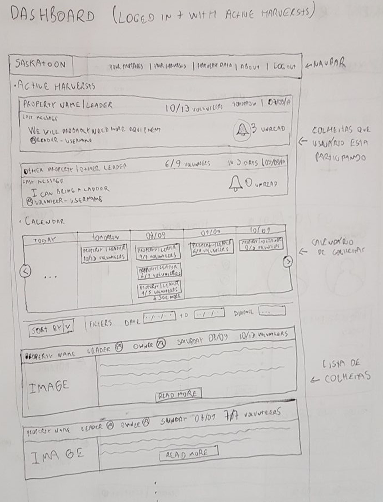
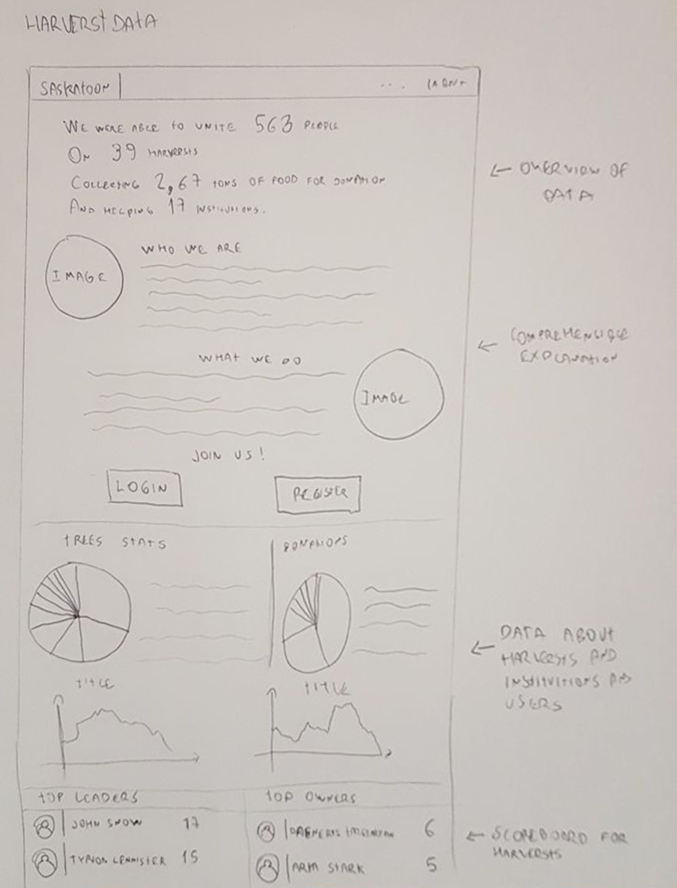
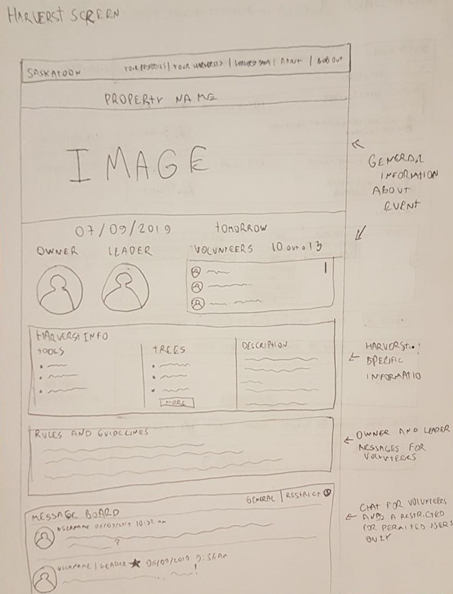

# Histórico de Revisão

|Data|Versão|Modificação|Autor|
|:--:|:--:|:--:|:--:|
|06/09/2019|0.1|Criação da estrutura do documento|Leonardo da Silva Gomes|
|07/09/2019|0.2|Adição dos tópicos Introdução e Protótipo de Baixa Fidelidade|Leonardo da Silva Gomes|
|07/09/2019|0.3|Adição do fluxo de usuário|João Pedro Silva de Carvalho|
|07/09/2019|0.4|Revisão|Leonardo da Silva Gomes e João Pedro Silva de Carvalho|
|07/09/2019|0.5|Adição do tópico tela|Leonardo da Silva Gomes|

## 1.Introdução

Este documento contemplará as informações acerca dos protótipos de baixa e alta fidelidade, criados para a construção da aplicação para colheita colaborativa.

## 2.Protótipo de Baixa Fidelidade

O protótipo de baixa fidelidade tem um viés de desenvolver estratégias e sintetizar ideias do grupo, para definir a iteração do usuário com o projeto e a base da futura visualização da aplicação.

Os protótipos a seguir foram desenvolvidos a partir de vários outros criados pelo grupo, com o intuito de deliberar ideias entre os membros. Com isso, foram geradas 2 versões preliminares do protótipo de baixa fidelidade:

- [Versão 1](https://github.com/fga-eps-mds/2019.2-TimeBolinho/issues/18#issuecomment-527721682)
- [Versão 2.1](https://github.com/fga-eps-mds/2019.2-TimeBolinho/issues/18#issuecomment-528601858)
- [Versão 2.2](https://github.com/fga-eps-mds/2019.2-TimeBolinho/issues/18#issuecomment-528914791)

### 2.1 Fluxo de usuário

### 2.2 Telas

#### 2.2.1 Dashbord

Essa tela será responsável por conter uma lista de colheitas cadastradas, para usuários já autenticados, um calendário semanal que mostrará as colheitas que irão ocorrer na semana, e uma lista de colheitas que você ainda pode ingressar.

#### 2.2.2 Harvest screen

Ao clicar em uma colheita para saber mais informações, essa página será aberta, nela conterá todas as informações da colheita: imagem, data, proprietário e lider. Para pessoas que já se cadastraram na colheita, haverá um chat para voluntários e organizadores, e aparecerá as regras e as necessidades da colheita (guidelines). 

#### 2.2.3 Harvest data

Nesta página ficará dispostos todas as informações gerais sobre as colheitas: dados, scoreboard entre proprietários e lideres, relatos de colheitas, e um overview do projeto.

## 3.Protótipo de Alta Fidelidade
