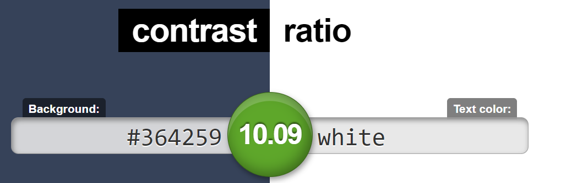

# Guia de Estilo e Identidade Visual

# Histórico de Revisão

| Data   | Versão | Modificação  | Autor  |
| :- | :- | :- | :- |
| 12/09/2019 | 0.1 | Criação da versão inicial do documento | Fabíola |
| 12/09/2019 | 0.1.1 | Adição da justificativa do nome da aplicação | Hugo Sobral de Lima Salomão |
| 13/09/2019 | 0.2 | Adição de componentes e contraste da paleta de cores | Fabíola |
| 13/09/2019 | 0.3 | Ajuste do slide da apresentação da identidade visual | Leonardo Gomes |
| 13/09/2019 | 0.4 | Ajuste de texto dos componentes e cores | Fabíola |

# 1. Introdução

# 2. Apresentação da Identidade Visual
<iframe src="https://docs.google.com/presentation/d/e/2PACX-1vRM9PQoXCnghUXGfKBRbxu7zDXxjQGPCUmpY7aDO074gj_OKAaHX-L1Q6PXcEPcYQJgukVNKK_OnLbZ/embed?start=false&loop=false&delayms=3000" frameborder="0" width="960" height="569" allowfullscreen="true" mozallowfullscreen="true" webkitallowfullscreen="true"></iframe>

# 3. Detalhamento e Justificativas

## 3.1. Nome da aplicação

Sobre a escolha do nome da aplicação, teve-se a ideia de utilizar **Acacia**, em português **Acácia**

O nome foi escolhido por conta da história por trás da planta acácia: A acácia é uma árvore que participa de uma relação **__interespecífica__**, **__harmônica__** e **__facultativa__**, com formigas, chamada de **__Protocooperação__**. Isto é, nem a árvore e nem as formigas, espécies diferentes, tem a necessidade de participar deste processo, mas ambas se beneficiam caso optem por cooperar.

Tal conceito se relaciona com o propósito do nosso projeto de colaboração voluntária e estimulação do senso de comunidade.

## 3.2. Fontes

As fontes utilizadas na aplicação serão:

 - **Raleway**(SIL OPEN FONT LICENSE Version 1.1), para títulos e 
 - **Roboto**(Apache License), para textos. 

Estas fontes são sans-serif, facilitando a leitura para pessoas com dislexia já que são "sem serif", isto é, não possui traços e hastes rebuscadas.

Além disso, estas fontes possuem boa adaptação para aplicações responsivas, como o deste projeto, adaptando-se para visualização web e mobile e também possuem licença que permite uso gratuito.

### Uso das fontes

#### Incluindo no HTML

Coloca-se no <head> o seguinte trecho de código:

	<link href="https://fonts.googleapis.com/css?family=Raleway|Roboto&display=swap" rel="stylesheet">

#### Incluindo no CSS

Coloca-se no css, para a utilização das fontes:

	font-family: 'Raleway', sans-serif;
	font-family: 'Roboto', sans-serif;

# 3.2.Paleta de cores

As cores foram selecionadas observando características do produto e sua finalidade, bem como a acessibilidade, testando-se o contraste. A ferramenta utilizada para construi-la foi [coolors](https://coolors.co/376996-56a3a6-364259-ef476f-edc841). 

A cor primária é a cor #376996, e a cor secundária #56a3a6. A cor #ef476f é acento.

Ainda, em relação ao contraste, foram feitos testes e é recomendado ter estes números em mente para utilização das cores.

# 4. Componentes

## 4.1. Botões

Existem botões utilizando as diferentes cores da paleta, a depender do uso. O botão comum de confirmação é da cor primária. Os botões são arredondados (border-radius de 12 px) com texto escrito utilizando a fonte Raleway tamanho 14pt, semibold, todas letras maiúsculas. Observa-se ainda a cor da palavra escrita, a depender da cor do botão, para cumprir o contraste.

## 4.2. Campos de formulários

O texto acima do formulário, de label, é na fonte Raleway, tamanho 12 pt, regular, na cor primária,com uma margem de 20px a esquerda, em relação ao campo.
O campo possui raio de 12px arredondado, e bordas na cor primária.

## 4.3. Navbar

Apresenta-se a seguir algumas opções para serem analizadas e decididas, para navbar.

### Para celular

### Para website

