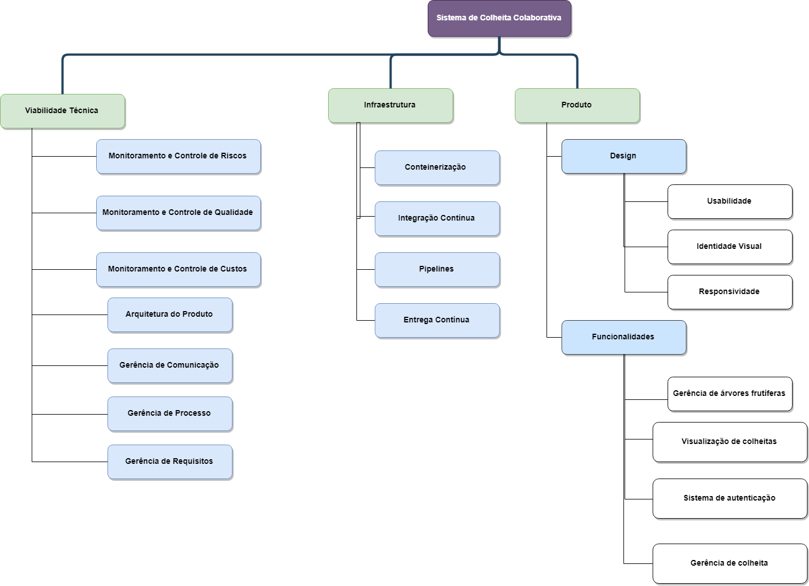

# Estrutura Analítica do Projeto

# Histórico de Revisão

| Data   | Versão | Modificação  | Autor  |
| :- | :- | :- | :- |
| 04/09/2019 | 0.1 | Criação da versão inicial do documento | Fabíola |

# 1. Introdução

Este documento inicia formalmente o projeto do Sistema de Colheita Colaborativa. Nas próximas sessões são detalhados: o que este projeto visa realizar, a oportunidade de negócio identificada, o escopo de atuação, os envolvidos (*stakeholders*), características de riscos, restrições e de custos, entregáveis, prazos e as ferramentas utilizadas no processo de desenvolvimento. Tais descrições visam elucidar a viabilidade do projeto.

# 2. Diagrama

