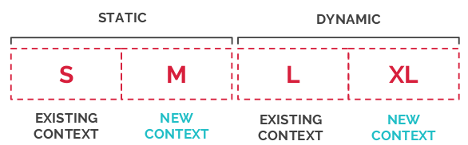
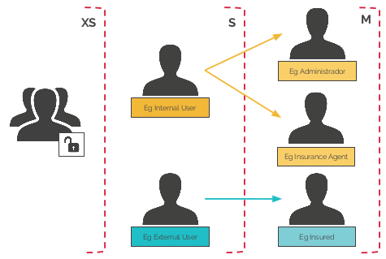
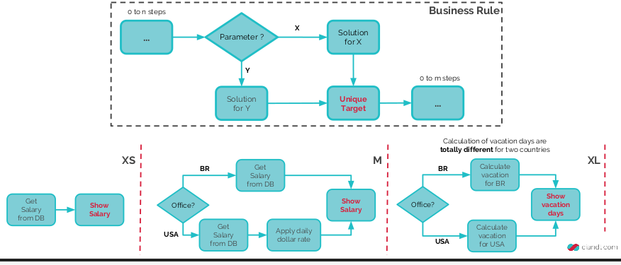

# Metricas e Indicadores

## Histórico de Revisão

| Data   | Versão | Modificação  | Autor  |
| :- | :- | :- | :- |
| 11/09/2019 | 0.1 | Abertura do documento | Martha Dantas |
| 14/09/2019 | 0.8 | Descrição das metricas e indicadores de gerenciamento | Martha Dantas |
| 05/10/2019 | 1.0 | Inclusão da descrição da metrica velocity | Martha Dantas |

Este documento tem como objetivo detalhar as metricas e indicadores que serão usando durante a execução do projeto. Os principais objetivos são manter a cultura das práticas ágeis, mensurar a complexidade das atividades, verificar a "saúde" do projeto  e a qualidade de código entregue.

## Business Complexity Points

Modelo criado por CI&T para mensurar e análisar complexidade. O modelo determina 10 itens de complexidades a serem observados, entretanto em virtude do contexto estudantil e se valendo da cultura de adaptação do Scrum, serão utilizados apenas 3, estes são:

- Interface Elements - Elementos de UI/UX do projeto. Sua mensuração é feita da seguinte forma:

    

- Roles/Permissions - Número de diferentes permissões, ou seja, níveis de acesso à aplicação. Sua mensuração é feita da seguinte forma:

    
    
 - Solution Variabilities - Soluções que cumprem um mesmo objetuvo de negócio podendo variar por influência de um parâmetro. Sua mensuração é feita da seguinte forma:
 
    

Obs.: Esse modelo mensura complexidade em código e será utilizado apenas nas issues de história de usuário e historias técnicas.

## Velocity

Mensura a capacidade de entrega de uma equipe. Utilizaremos a escala de fibonacci para estimar, com base em nossa experiência, a capacidade de entrega de nossa equipe.

Obs.: Essa metrica será utilizada para mensurar capacidade de entrega de issues que não sao de desenvolvimento, tais como, documentação, estudo e etc.

## Squad Health Check Model

Modelo criado por Spotify para mensurar e análisar a saúde de um projeto. Ele elicita 11 itens a serem observados:

## Práticas Ágeis 

Modelo para verificar a utilização das práticas ágeis durante o projeto. Serão elencados as práticas ageis a serem usadas durante as sprints, além de avaliar sob a diretriz da escalade likert quão bem foi aplicada essa prática

## Quadro de Conhecimento

Modelo que mensura o conhecimento da equipe em diversos aspectos. Tambem útil para avaliar a evolução e a gestão de conhecimento da equipe.

Pode ser encontrado em : [Quadro de Conhecimento](https://docs.google.com/spreadsheets/d/1RKcA2VR6jS--O1DSd3KZ6vcl8PCMI4f9WJ8x_1HUqek/edit?usp=sharing)

## Qualidade em Código 

As principais metricas que utilizaremos em código são:
    - Teste unitário cobertura de 90%
    - CC - complexidade ciclomática 
    - LOC - linhas de código por método
