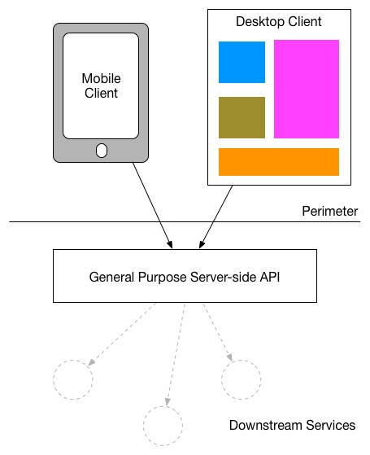

# Post Mortem

## Histórico de revisão

| Data   | Versão | Modificação  | Autor  |
| :- | :- | :- | :- |
| 08/11/2019 | 0.1 | Criação da estrutura do documento |  Fabíola |
| 14/11/2019 | 0.2 | Adição do tópico de capacitação do time | Shayane |
| 15/11/2019 | 0.3 | Adição dos sentimentos | Shayane e Renato |
| 15/11/2019 | 0.4 | Adição dos sentimentos e revisão | Hugo |
| 15/11/2019 | 0.5 | Adição do tópico Arquitetura | Flavio e Durval |
| 15/11/2019 | 0.6 | Adição dos sentimentos | Durval |
| 15/11/2019 | 0.7 | Revisão e Alteração no tópico de arquitetura  | Durval e Flavio |
| 15/11/2019 | 0.8 | Adição dos sentimentos | Flavio |
| 16/11/2019 | 0.9 | Escrita das tecnologias utilizadas no frontend e DevOps | Hugo |
| 16/11/2019 | 1.0 | Adição do tópico Django, Django REST Framework e Postgres | Durval |
| 17/11/2019 | 1.1 | Adição do tópico entrega da R1, entrega da R2 e sentimentos | Fabíola |
| 17/11/2019 | 1.2 | Adição dos sentimentos do João Pedro | João Pedro |

# Introdução

Este documento é uma reflexão do time, realizada na fase de finalização do projeto, para concretizar as lições aprendidas e permitir que projetos futuros similares possam ser facilitados.

# Metodologia e Processo

# Tecnologias utilizadas

## Tecnologias utilizadas no backend

### Django, Django REST Framework e Postgres

No backend desse projeto as 3 principais tecnologias que foi
utilizadas foram o Django, o app Django REST Framework e o
sistema gerenciador de banco de dados relacional Postgres.

Essas tecnologias se mostraram flexíveis e adaptáveis para as
nossas necessidades e com um curva de aprendizagem compatível
com o tempo de desenvolvimento do projeto.

## Tecnologias utilizadas no frontend
### Vue.js
Vue.js é um framework progressivo de JavaScript, de código aberto, para o desenvolvimento. As vantagens desta opção de ferramenta estão sintetizadas em sua acessibilidade simplificada, ecossistema com adoção incremental e versátil, desempenho performático e arquitetura reativa.

Uma das mais importantes ressalvas acerca da utilização deste framework dentro do projeto é a sua baixa curva de crescimento quando comparado a outros ferramentas de desenvolvimento web, como *React JS* ou *Angular*. Isto é, o ***Vue.js*** exigiu uma carga de tempo relativamente pequena para que os membros conseguissem compreender a arquitetura do framework e o seu respectivo fluxo de eventos.

Durante as fases iniciais do projeto a falta de conhecimento de Vue.js, por parte da equipe, teve um grande peso negativo em cima da velocidade des entregas. Não obstante, o time ao entrar em contato direto com a tecnologia, por consequência, ganhou familiaridade e domínio sobre a tecnologia, o que fez com que a velocidade das entregas fosse incrementada depois de um longo período de lentidão.

## Tecnologias utilizadas na configuração dos ambientes
### Docker e docker-compose
Docker é um software contêiner que fornece uma camada de abstração e automação para virtualização. o Docker utiliza isolamento em camadas de núcleo de sistemas operacionais e melhora o desempenho da comunicação entre a imagem virtualizada e os recursos de hardware.

Já o docker-compose funciona como um orquestrador de contêiners Docker.

Os recursos disponíveis dentros das tecnologias Docker possibilitaram ao time uma facilidade na configuração e preparação dos ambientes.

# Arquitetura

No início do projeto, foi analisado a possibilidade da
utilização da arquitetura de microsserviços no projeto.

Porém após alguns debates em grupo ficou claro que essa
abordagem não iria agregar muito valor no nosso projeto e
iria aumentar significativamente a complexidade da
arquitetura do projeto.

Dessa maneira, ficou decidido que iriamos dividir o projeto
em dois repositórios, obedecendo um padrão de projeto
semelhante ao (Backend for Frontend)[https://samnewman.io/patterns/architectural/bff/].
Nesse padrão, temos um backend dedicado à nossa aplicação,
com uma interface RESTful, para suportar as requisições da
aplicação.

	

Esses subprojetos, por mais que estejam intimamente
conectados, ambos possuem sua própria arquitetura, herdada
do framework que adotamos, o Django e o Vue.Js.

# Capacitação do Time

Todas as issues de treinamento aqui sintetizadas, foram registradas no repositório, podendo ser filtradas pelas labels: ["training"](https://github.com/fga-eps-mds/2019.2-Acacia/issues?q=is%3Aissue+label%3Atraining+is%3Aclosed) e/ou "meetings".

#### Planejamento

No início do semestre, percebemos a importância de planejar treinamentos com as tecnologias que previamente já tínhamos em mente: Git, Github, Metodologia ágil, HTML, CSS, Docker e Javascript ou algum framework específico. Em agosto iniciou-se os treinamentos planejados para auxiliar no andamento do projeto. Como não tínhamos um projeto definido, realizávamos nossas reuniões juntamente com os treinamentos aos sábados.

#### Git, Github e Scrum

O primeiro treinamento foi o de Git, Github e metodologia ágil: Scrum, todos ministrados pelos membros de EPS. Sobre o treinamento de Git, alguns membros de MDS já possuiam conhecimento prévio, portanto não foi uma tecnologia muito nova. Apesar disso, foi uma dinâmica completamente nova para outros e por isso, pode haver o compartilhamento do conhecimento desde antes do início do desenvolvimento.

O treinamento de Scrum, adaptado ao XP era essencial porque era com ele que iríamos trabalhar durante todo o projeto, então foram explicados todos os métodos necessários para o bom funcionamento da metodologia. A forma que a Scrum Master ministrou o treinamento, em que havia uma simulação entre os membros com seus respectivos papéis, possibilitou uma grande absorção do processo.

#### Docker

Houve também o treinamento de Docker, que mostrou-se necessário para os membros de MDS e EPS saberem o que estavam usando, visto que nem todos sabiam os termos e práticas. O treinamento foi ministrado por um membro de EPS com a estratégia de um tutorial prático de um pequeno ambiente com as principais funcionalidades. Isso contribuiu para que, no decorrer do semestre, os membros propunham mudanças nos arquivos de configuração.

#### HTML, CSS e Vue.js

O treinamento de HTML e CSS foi realizado np período de agosto porque até então a equipe não possuía os temas definidos, ou seja, aproveitamos o tempo para permitir um maior vivenciamento com os elementos de estilização que provavelmente iríamos utilizar.

Após as escolhas de tecnologia, Vue.js para o frontend e o Django Rest para o backend, procuramos um voluntário para ministrar o treinamento de Vue, já que ninguém da equipe tinha conhecimentos suficientes. O treinamento, realizado no horário do almoço, permitiu que os membros pudessem ter uma noção básica das funcionalidades do framework. Por questões de disponibilidade dos membros e da grande quantidade de conteúdo, optamos por realizar o treinamento apenas de Vue.js.

#### Django Rest

Já o treinamento de Django Rest não foi realizado por falta de disponibilidade dos membros e pelo acúmulo de tarefas em diversas matérias. Além disso, os membros mostravam no começo uma maior confiança com python, o que deu uma pseudo sensação de que a equipe teria mais dificuldades no front. No decorrer do tempo, percebemos que essa primeira impressão não condizia com a realidade dos membros, pela constante dificuldade nas issues ou pelo próprio depoimento nas retrospectivas em relação ao django. No fim, a maioria dos membros possuiam mais crescimento no frontend.

#### Pontos de melhoria

Após discussões com os membros de MDS, foi notória a necessidade de treinamentos referente a testes unitários no frontend. Isso refletiu na deficiência dos testes em Vue e na delimitação dos critérios de aceitação do projeto.

# Entrega da R1

A entrega intermediária do semestre foi um marco importante para equipe. Teve como objetivo principal a validação de documentos e artefatos que preparavam para o andamento do projeto e concretização do produto. Foi exposta a viabilidade técnica do produto e a visão da equipe quanto a ele, e o feedback realizado pelos professores foi documentado na issue [115](https://github.com/fga-eps-mds/2019.2-Acacia/issues/115). Em preparação para essa entrega, foram feitas diversas discussões e percebido algum desalinhamento entre membros da equipe. Inicialmente, a equipe teria contato com um mantenedor de um projeto de software livre, Saskatoon, para mapear as necessidades dos usuários e auxiliar no entendimento do produto. Porém, o mantenedor não possuia disponibilidade e a equipe então criou um produto mais independente, porém ainda alinhado com o que já tinha sido estudado e explorado na ferramenta Saskatoon.

Nesse período entre o início do semestre até a entrega da Release 1 foram muitos os aprendizados e decisões realizadas pela equipe. Mudanças foram constantes, e observaram alguns pontos principais de melhorias, sendo eles:

- O escopo do projeto até então, era muito grande para ser realizado durante o tempo do semestre;
- Falta de alinhamento na equipe em relação aos objetivos do projeto e visão de produto, pois os membros estavam focados em atividades de forma individualizada;
- Tarefas muito grandes, resultando em poucas entregas e dificuldade de entender o que estava sendo feito;
- Problemas no processo e em documentação das sprints, dificultando o entendimento dele e possíveis melhorias.

# Entrega da R2

Durante o período pós Release 1, a equipe discutiu o feedback e realizou adaptações para prosseguir com o projeto. Apesar de dificuldades, observou-se que o conhecimento nas tecnologias foi aumentando com o tempo, bem como a confiança e produtividade, embora que no início desse período ainda existia muita insegurança de MDS e medo de colocar a "mão na massa". Alguns pontos porém, também causaram dificuldades, membros resistindo à utilização de bibliotecas e ferramentas dos framework, quebrando a arquitetura definida e a falta de conhecimento em relação à técnicas de programação, dificultaram entendimento do código e evolução do produto, pois existiram partes que eram entendidas por alguns membros e outras partes que por mais que tinham que ser replicadas em outros lugares, a reutilização do código era dificultada. Um problema que permaneceu foi o planejamento e documentação das sprints, a equipe não foi orientada pelas métricas e pouco se fez para gerenciar os riscos e melhorar a gerência e planejamento das sprints, o que acarretou na concretização de vários riscos e dívidas técnicas, tendo ainda ao final do projeto, outro desafio, o cansaço do semestre.

# Escopo do projeto

# Sentimentos da Equipe

### Renato

Aprendi muito sobre desenvolvimento de software, muito além do código. O trabalho em equipe é o que faz o conhecimento e determinação de cada um se destacar. Durante uma parte significativa do projeto, reconheço que faltei com trabalho em equipe porque não enxergava seu valor, o que mudou durante o decorrer e tomei conta do quanto é relevante, acima de tudo, um time com moral alta que trabalha junto e se apoia à cada dificuldade. O valor do pareamento, cujo o qual fui aprender apenas após tempo significativo, se tornou claro e quando pude vê-lo, entendi sua importância. A integração de um time ressalta as habilidades somadas dos membros: um grupo de pessoas vai bem mais longe e bem mais alto que um programador lone wolf.

Sobre um aspecto mais técnico, o projeto também me ensinou a ter uma postura de engenheiro: em pensar nas decisões, levando em conta as alternativas e pesos, balanceando tempo, viabilidade técnica, qualidade de código, mantenabilidade entre outros fatores. Também aumentei minha proficiência em Git e Github, aprendendo o workflow usado para se fazer softwares modernos, e a utilizar Docker. Aprendi a fazer testes embora ainda sinta que falta muito mais, foi um ótimo começo.

No geral, já via MDS como uma matéria essencial para quem quer ser um engenheiro de software de verdade, mas pelos motivos errados. Hoje, por causa dela, enxergo que software vai além de projetos e envolve muito mais do que antes imaginei.

### Shayane

O começo da disciplina foi um desafio para todos os membros, principalmente na aplicação da metodologia alvo. Foi complicado para o time de MDS reconhecer as utilidades da correta adoção das métricas e isso acabou causando um estresse. No entanto, com o passar do tempo e com discussões construtivas, o grupo todo amadureceu bastante essas questões e pode se preocupar com outras questões mais importantes. Notamos desde o começo alguns membros que não se sentiam muito confortáveis em trabalhar com pareamento ou que se sentiam inseguros em relação aos outros membros, em questões de conhecimento. Percebemos que isso seria um problema se não tratado rápido e não deixamos de tentar resolver isso, seja na escolha do pareamento, supervisão do repositório e discussões nas dailies e retrospectivas.

Sobre o matéria em si, foram imensas as oportunidades de aprendizado. Houve uma alta alternância/rotatividade dos papéis de arquiteto e devops, permitindo que ambos pudessem aprender termos e práticas antes não desenvolvidas por eles mesmo. Além disso, os membros de MDS tiveram bastante crescimento, indicado no quadro de conhecimento e no andamento das sprints.

O que chamou bastante atenção também foi o trabalho em equipe e a contribuição de alguns membros para ajudar outros em suas issues. Em relação à metodologia, houveram algumas dívidas técnicas em algumas sprints e senti que o grupo de EPS tinha dúvidas em relação a como agir para contornar e planejar melhor as sprints. Além disso, com a release 2, foi notória a maior participação dos membros de MDS nas discussões e questionamentos de certas demandas, apesar do estresse em relação ao curto tempo para entregar um escopo. Foi notória também a necessidade de acompanhar a saúde mental dos membros, que com muitas demandas da faculdade se sentiam sobrecarregados por todos os lados.

A matéria por si só já vem com uma pressão grande em todos e é difícil controlar esse medo ao longo do semestre, eu mesma tinha medo de não me adaptar ao grupo ou não conseguir fazer as demandas, mas eu não poderia ter uma equipe melhor, com todo o suporte que recebi, apesar de todos os altos e baixos. :rosette:

### Hugo

Minhas primeiras impressões sobre a matéria de MDS foram as mais esperançosas possíveis. Eu tinha uma grande curiosidade sobre como funcionavam as metodologias e cargas de trabalho que rondeavam a matéria, que é conhecida dentro da faculdade como "divisora de águas" para o curso de engenharia de software, e não demorou muito para essa curiosidade ser sanada, já que a demanda por tarefas foi grande desde o começo do semestre e vem se mantendo constante desde então.

Poder trabalhar como um time, alinhado por uma causa e propósito, tem sido maravilhoso. Entretanto, esta nem sempre foi a situação da equipe da Acácia, o começo do projeto foi uma fase dura e confusa (às vezes até mesmo desmotivadora), em que alguns dos membros se encontravam perdidos em meio ao andamento do projeto e dos porquês de estarmos trabalhando da forma como estávamos (e ainda estamos) trabalhando.
Ainda assim, com o passar do tempo a equipe foi se unindo cada vez mais, e cada vez mais eu consegui me sentir pertencente a um time de trabalho.

Além disso, o contato com um projeto grande me possibilitou o aprendizado sobre metodologias de desenvolvimento e a especialização em algumas das tecnologias que estamos usando para a construção da Acácia. Pude também aprender bastante sobre como funciona o andamento de um projeto e como trabalhar com um time ágil. A Ácácia me possibilitou ter contato também com contribuições em repositórios no GitHub, o que me motivou a conhecer mais sobre o mundo de Software Livre.

Em relação às entregas, restam alguns traços de preocupação em volta do tempo restante de trabalho, já que a matéria de MDS/EPS possui um ritmo acelerado quando comparado à quantidade de trabalho necessária.

Por fim, me sinto grato de todas as formas possíveis por ter trabalhado com o time da Acácia, pude criar e reforçar laços de proximidade com pessoas incríveis dentro do projeto, além de receber, sempre que preciso, suporte dos membros da equipe. :heart:

### Durval

A matéria de MDS sempre foi um monstro na minha cabeça.
Era frequente eu ouvir de amigos que essa matéria iria
exigir a alma e que iria definir se você pertence ou
não ao curso.

Isso me fez postergar o máximo possível a matéria até
que eu me sentisse preparado para enfrentar esse monstro.
Eu lembro que nas férias anterior ao semestre que iria
me inscrever eu fui atrás de todos os frameworks e
tecnologias que os projetos dos anos anteriores tinham
usado, fui atrás das metodologias ágeis que tanto eram
faladas, eu realmente estava desesperado...

Eu estava encarando a matéria como se fosse uma maratona,
em que eu precisava me preparar com meses de antecedência.

Outro fato que me preocupava bastante era o fato de
trabalhar em equipe. A única referência de trabalho em
equipe que tinha foi o 3° projeto da matéria de
Orientação à Objetos e que foi um completo desastre.
Eu morria de medo de o grupo olhar para mim e não poder
contar comigo…

Então quando finalmente chegou no primeiro dia de aula,
eu encontrei com o meu grupo, que ainda não tinha tanta
intimidade e abracei a causa. Eu queria mostrar trabalho
de todas as maneiras possíveis, sempre que surgia qualquer
coisa pra fazer eu queria ser o primeiro a começar, para
justamente não parecer que eu não sabia fazer as coisas.

Com o tempo e com as diversas conversas que tivemos em
grupo, essa sentimento de se provar para o grupo foi
diminuindo até o ponto de eu não me sentir mal de está
estudando para outra matéria invés de está fazendo as
coisas de MDS.

Hoje eu vejo que foi uma besteira encarar a disciplina
com a visão que eu tinha. Por mais que eu não me arrependa
de ter me preparado para a disciplina, eu vejo que poderia
tranquilamente ter me inscrito na matéria ainda calouro que
o meu grupo estava preparado e disposto a guiar alguém assim.

### Flavio

Eu era aluno de engenharia eletrônica e tinha mudado recentemente para
engenharia de software. Devido a não conhecer muito a grade de engenharia de
software, eu sempre escutava algumas frases do tipo: MDS é bem pesado, MDS
demanda muito tempo, e por aí vai. Mas, até então, a maioria das disciplinas
que fiz na faculdade tinha uma fama parecida.

Porém MDS é diferente é muito mais complicado do que tinha imaginado. Foi a
primeira disciplina que vi que o pré-requisito da disciplina significa muito
pouco. Os quatro créditos da disciplina passa muito longe de refletir o número
de horas necessário para fazer a disciplina com bom aproveitamentop. Um aluno
que fez somente as disciplinas do fluxo normal não tem bagagem suficiente para
fazer MDS.

Na minha primeira reunião, onde encontrei o grupo completo, percebi que não
tinha os requisitos mínimos. O primeiro sentimento foi de frustração e
desespero. Com isso, estava praticamente decidido a trancar a disciplina, por
temer não conseguir acompanhar o grupo, ou pior atrapalhar o bom andamento dos
trabalhos. Mas, devido à importância da disciplina e o incentivo de alguns dos
membros do time, decidi por lutar pela disciplina, mesmo sabendo que não tinha
base suficiente.

Sempre tive receio de trabalho em grupo, pois todas as experienciais anteriores
foram fracassadas. Contudo, o grupo como um todo estava muito engajado e com um
projeto caminhando a todo vapor.

Na forma que a disciplina está organizada é uma excelente oportunidade para
trabalhar em grupo com projeto real. Porém, fui levado a aprender uma grande
demanda de conteúdos de forma independente. E o estudo independente requer
muito esforço, pesquisa e prática.

Apesar de gastar muito tempo estudando, às vezes tenho uma sensação de
frustração com a minha improdutividade. Parece que a cada novo problema eu era
jogado para a estava zero.

Devido a grande exigência da disciplina e número de tecnologias e frameworks
que é necessário aprender sozinho, ainda é preciso dedicar tempo a reuniões
semanais. Com isso, a disciplina consome muito mais tempo de estudo que
qualquer disciplina de 4 créditos até mais tempo que disciplinas de 6 créditos.
Assim, obrigando o aluno a abrir mão de boa parte do tempo de outras
disciplinas para dedicar a MDS e/ou reduzir o número de disciplinas do período
e por consequência tirando o aluno do fluxo normal do curso.

Apesar das grandes dificuldades e inexperiência, trabalhar em projeto grande
me possibilitou ampliar muito o conhecimento em diversas tecnologias e também
favorece melhoras no relacionamento interpessoal e melhorar a visão de como
trabalhar em equipe.

Por último, a minha sensação é que a disciplina não deveria estar no 4°período
e poderia ter mais créditos.

### Fabíola

Essa foi a minha segunda tentativa de EPS, e é a única matéria de projeto que falta para concluir o curso, depois de PI2 e outras várias matérias de projeto acredito já ter chegado na matéria com certo cansaço de fim de curso. Com isso em mente, tive como postura a tentativa, que se provou nada fácil, de tentar equilibrar a realização de um projeto que fosse interessante e que mantivesse a equipe motivada, mas ao mesmo tempo sempre com o cuidado em relação a saúde dos membros. Os integrantes de MDS estavam desde o início muito animados e empolgados, então foi complicado tentar entender como não sobrecarregá-los e ao mesmo tempo não "matar" essa motivação, desacelerando eles. O trabalho realizado pela equipe foi importante e existiu um grande apoio entre os membros de EPS, que não se restringiram cada um ao seu papel, o que foi reconfortante, e também MDS foi, desde o início, muito proativo. A equipe não hesitou também a procurar ajuda externa, sendo de colegas ou professores do curso, o que propiciou ainda mais aprendizado.

### Martha 

Eu tenho muita muita coisa para falar tanto da matéria quanto da minha equipe e de mim. Mas juro que vou tentar ser breve. EPS é aquele tipo de matérias que todo mundo conhece pela fama e por isso adiei ela até que minha vida estivesse estabilizada. Eu queria dar o meu melhor e ir tão bem ou melhor do que fui quando fiz MDS. Por isso antes mesmo do semestre começar ja tinha uma equipe e um grupo de mds que se juntaria a nós. Assim nasceu o ElisBolinho¹. De cara todo mundo se deu bem e as expectativas de fazer um bom trabalho era um sentimento de todos.
Nós nos indentificamos com o tema de colheita coletiva, principalmente pela possibilidade de pegar um projeto em andamento e pelo contato que teriamos, ou achamos que teriamos, com um desenvolvedor experiente. Entretanto no inicio do projeto acabamos por descobrir que essa interação não ocorreria e esse foi nosso primeiro balde de água fria. Saimos de um projeto real em andamento com um público de úsuarios, para um codigo que até então era uma caixa preta para nos e nao teriamos ajuda para desvendá - los. O baque em MDS foi mais forte pois ele perderam os propositos que os motivaram a querer esse tema. Eu confesso que fiquei triste mas isso nao mudou meu desejo de fazer dar certo. A verdade é que minha motivação nunca esteve no tema do projeto e sim no nosso trabalho, em conseguir fazer esse time dar certo. Fazer eles realmente sentirem que estão trabalhando dentro das metodologias da nossa area de formação. Talvez por isso tenha sido um pouco dura com alguns dos meninos(MDS). Ver que eles não entendiam o propósito de EPS e não entendia a importância de cada reunião, cada medição de metrica era ver eu falhando enquanto gerência. Eu sei que estavamos ali para aprender e que errar era esperado, mas ninguém gosta de falhar. Então nesse ponto confesso que fiz uma gerencia de risco muito mais intuitiva, baseada mais na minha experiencia, do que em dados. Dados são bons para medir trabalhos, entregas, artefatos, mas nem sempre para medir pessoas. Como scrum master minha percepção foi que o mais importante para sintonia da equipe seria ter um propósito. Se a equipe tem um propósito que seja oriundo do tema ótimo, mas se não e esse foi o nosso caso, é preciso usar dos propósitos pessoais e achar um que abarque a maior parte ou toda a equipe. Eu sabia que EPS não seria um problema pois todos tinham motivações semelhantes as minhas, mas MDS precisava de algo mais do que a máteria. Não foi fácil, no inicio todos estavam bem perdidos e nem sempre eles entendiam ou se sentiam confortáveis para questionar nossas decisões, principalmente as minhas. Por isso sempre tentei deixar bem explícito os porquês das decisões e sempre tentei trazer questionamentos a respeito do nosso objetivo como equipe. Espero ter conseguido (Risos). Com tempo MDS foi tomando confiança e depois de alguns puxões de orelha eles sairam de seis estudantes à seis futuros engenheiros de software. Cada um cresceu um pouco, seja no trabalho em equipe, no conhecimento das tecnologias ou em entender a importância de seguir um processo de desenvolvimento de software.
Diversas coisas aconteceram e infelizmente não pude dar meu melhor mas a verdade é que eles não precisaram do meu melhor. Mesmo nas minhas ausências a equipe se manteve e seguiu evoluindo, construindo um produto de software que honestamente eu tenho orgulho de ter construído. Talvez alguns deles nunca mais queiram trabalhar com uma pessoa chata e tão irritantemente fiel a metodologias(eu). Mas pelo menos eles aprenderam como será o caminho, ou pelo menos parte dele, para se tornar um bom profissional. 

### João Pedro 

Eu não sabia o que esperar de MDS. Muito se falava dessa matéria como a mais importante do curso, e agora entendo o porquê. No começo tive muito medo de não conseguir dominar as tecnologias e ser um fardo para a equipe e além disso seria a primeira vez que eu estaria realmente em um lugar mais próximo de um trabalho de engenharia de software. Por outro lado seria a primeira vez que eu ia realmente trabalhar em uma equipe de software, algo que era realmente novo para mim.
Acho que a maior dificuldade que eu encontrei na matéria, não foi propriamente a matéria e sim conseguir conciliar ela com as demais e com a vida no geral. No começo não consegui fazer isso direito mas depois eu tudo se ajeitou naturalmente. A partir dai comecei a aprender cada vez mais as tecnologias usadas, naturalmente encontrei mais facilidade em uma e em outra sinto uma dificuldade maior.
Acho que o maior ganho que eu levo de MDS, mais que propriamente as tecnologias, é aprender como é o processo de criação de um software saudável de modo que esse processo seja mais rápido e mais econômico alem de levar uma participação maior dos clientes.

# Conclusão
