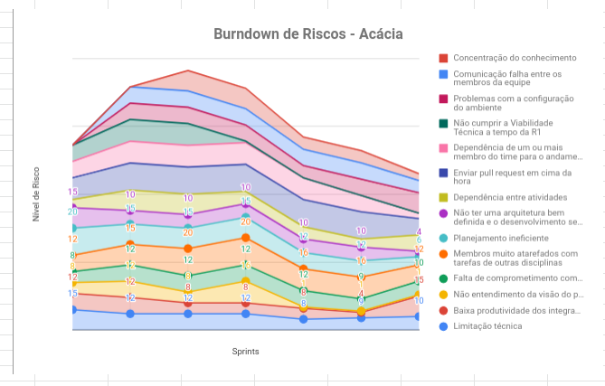
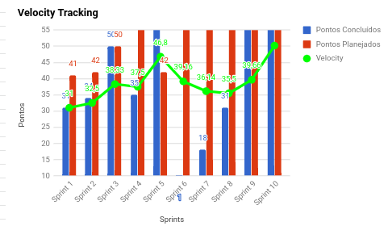
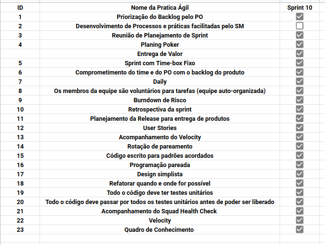
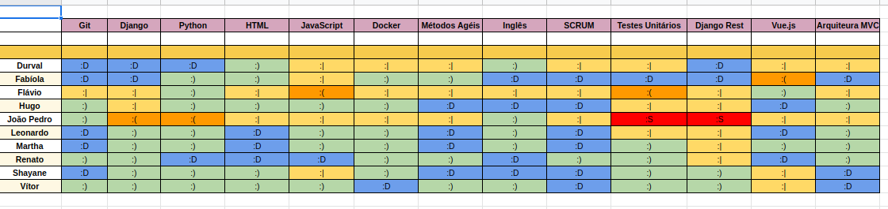
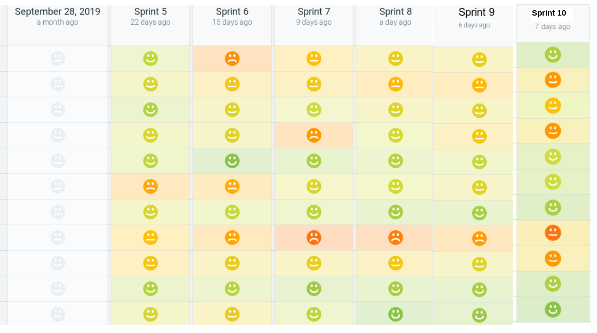

# Sprint 8

## Histórico de revisão
| Data   | Versão | Modificação  | Autor  |
| :- | :- | :- | :- |
| 16/11/2019 | 0.1 | Criação do documento | Martha Dantas |
| 16/11/2019 | 1.0 | Escrita dos tópicos do documento | Martha Dantas |

# Planning da Sprint 9

- Período : 04/11 a 09/11

- Objetivo: Organizar o código do projeto e trabalhar as issues que são prioridade, ou seja, as issues que agregam  mais valor segundo a P.O.

## Issues

| ID | Descrição | Estimativa | Label |
| ---|-----------|------------|-------|
| #67 | Cadastro de Árvore | 13 | MDS/EPS |
| #75 | Landing page simplificada | 8 | MDS |
| #116 | Visualização do dashboard do usuário | 8 | MDS|
| #150 | Iniciar escrita do postmortem | 5 | MDS/EPS |
| #155 | Resolver as migrações do app harvest que não estão automaticamente sendo migradas | - | EPS |
| #160 | Documentação da Sprint 9 | 5 | EPS |
| #161 | Party Hard | 56 | EPS |

# Dívida alocada

ID | Descrição | Estimativa | Label|
---|-----------|------------|-------|
| #73 | Atualizar Perfil do Usuário | 38 | MDS |
| #153 | Substituição do toasted | 8 | MDS/EPS |

 - Total de pontos planejados: 85pts.
 - Total de pontos entregues: 39pts (mais 56pts de lazer #161).

 # Possíveis riscos mapeados para a sprint

# Review

-  Objetivo Alcançado?

Sim. Apesar

- Estimativa correta? 

 Não.Algumas issues foram criadas durante a sprint o que afetou a assertividade de nossa estimativa.

- Tarefas bem distribuidas? 

 Sim.

## Qualidade do Trabalho Entregue

Segundo a equipe a qualidade entregue foi de **3,6** considerando a escala de likert com os valores de 1 a 5.

## Velocity

# Retrospectiva

Segue imagem com todos as questões levantadas durante a retrospectiva.

# Práticas ágeis 

# Quadro de Conhecimento

# Squad Health Check

# Análise da Scrum Master

