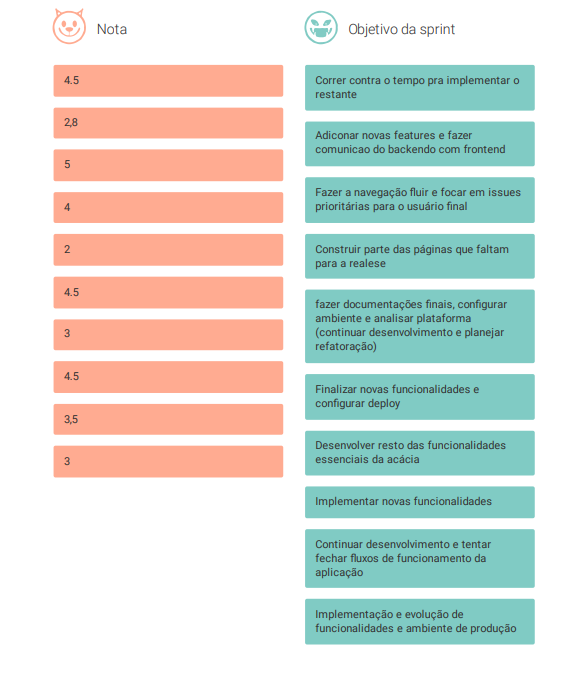
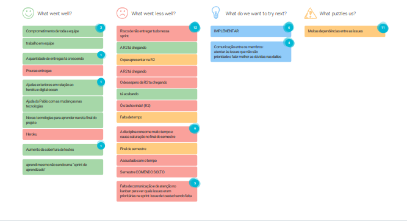
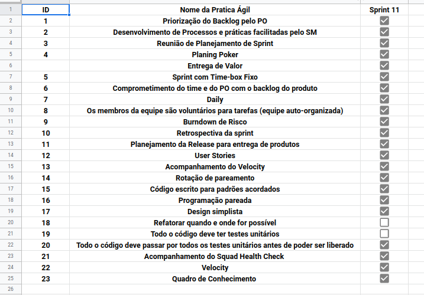
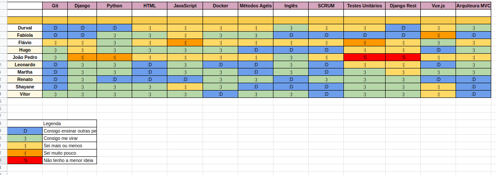
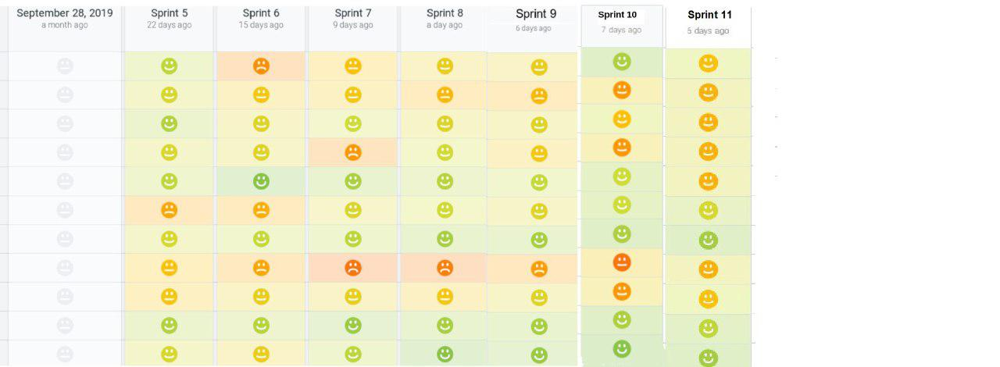

# Sprint 10

## Histórico de revisão
| Data   | Versão | Modificação  | Autor  |
| :- | :- | :- | :- |
| 21/11/2019 | 0.1 | Criação do documento | Martha Dantas |
| 21/11/2019 | 0.9 | Escrita dos tópicos do documento | Martha Dantas |
| 22/11/2019 | 1.0 | Escrita da análise da Scrum Master | Martha Dantas |
| 23/11/2019 | 1.1 | Corrigindo equívocos com dívidadas técnicas | Martha Dantas |

# Planning da Sprint 

- Período : 11/11 a 16/11

- Objetivo: Preparação para finalizar o fluxo do usuário na aplicação.

## Issues

| ID | Descrição | Estimativa | Label |
| ---|-----------|------------|-------|
| #69 | Visualização de Colheita | 13 | MDS |
| #120 | Visualização de propriedades | 13 | MDS |
| #165 | Criar a Release 2 | 3 | EPS |
| #166 | Evoluir o dashboard do usuário | 13 | MDS/EPS |
| #167 | Verificar os fluxos de funcionamento da aplicação | 5 | MDS/EPS |
| #172 | Documentar a sprint 10 | 5 | EPS |
| #176 | Criar máquina no digitalOcean | 1 | EPS |
| #177 | Configurar o ambiente de homologação no docker-compose para o deploy | 5 | EPS |
| #178 | Configurar o ambiente de produção no docker-compose para o deplo | 5 | MDS/EPS |
| #80 | Configurar ambiente de produção do backend | 13 | EPS/MDS |

# Dívida alocada

ID | Descrição | Estimativa | Label|
---|-----------|------------|-------|
| #158 | Automatizar migrações no github actions | 8 | EPS | --> Descartada por mudanças na ferramenta de migraçao ver em issue [#178](https://github.com/fga-eps-mds/2019.2-Acacia/issues/178) e [#177](https://github.com/fga-eps-mds/2019.2-Acacia/issues/177)
| #168 | Desenvolver a escrita do post mortem | 8 | EPS/MDS |

 - Total de pontos planejados: 92pts.
 - Total de pontos entregues: 76pts.

 # Possíveis riscos mapeados para a sprint

dados perdidos 

# Review

-  Objetivo Alcançado?

Sim. A equipe conseguiu determinar as issues necessárias para finalizar o fluxo que nos propusemos a entregar. 

- Estimativa correta? 

 Não. Algumas issues demandaram mais trabalho do que o estimado.

- Tarefas bem distribuidas? 

 Sim.

## Qualidade do Trabalho Entregue

Segundo a equipe a qualidade entregue foi de **3,7** considerando a escala de likert com os valores de 1 a 5.

## Velocity

# Retrospectiva

Segue imagem com todos as questões levantadas durante a retrospectiva.

# Práticas ágeis 

# Quadro de Conhecimento

# Squad Health Check

# Análise da Scrum Master

Foi uma semana de análise e tomada de decisão a respeito do produto final que entregaremos na release 2. Como não poderia ser diferente usamos de mais tempo para avaliar o que foi entregue e como isso ajudou ou não nosso objetivo final. A equipe demonstrou sentir a tensão do final do semestre. Entretanto nossos indicadores demonstram que mesmo com essa tensão nos continuamos evoluindo. O conhecimento da equipe e principalmente nossa capacidade de entrega constinua aumentando de maneira a nao sobrecarregar membros. Nossa qualidade,numa análise pessoal da equipe, obteve uma leve melhora. Acredito que entregaremos um bom trabalho e que a sprint 12 que está por vir mostrar indicadores ainda melhores que estes aqui presentes.

