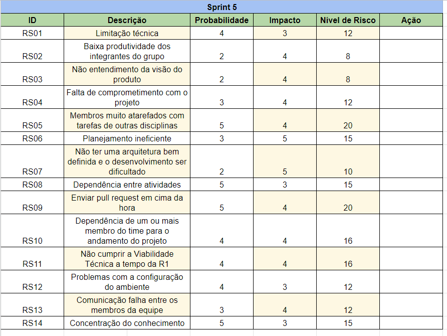
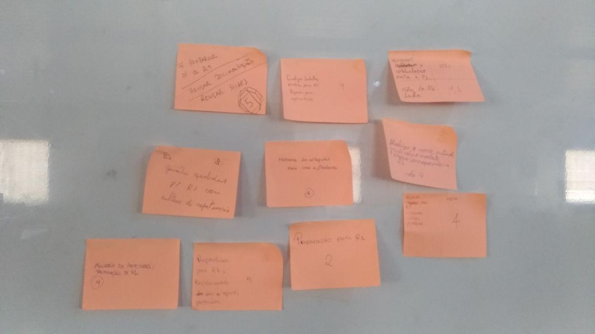
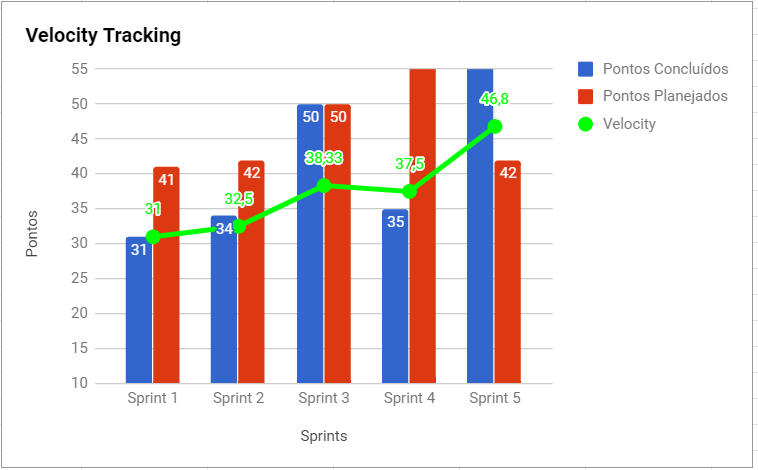
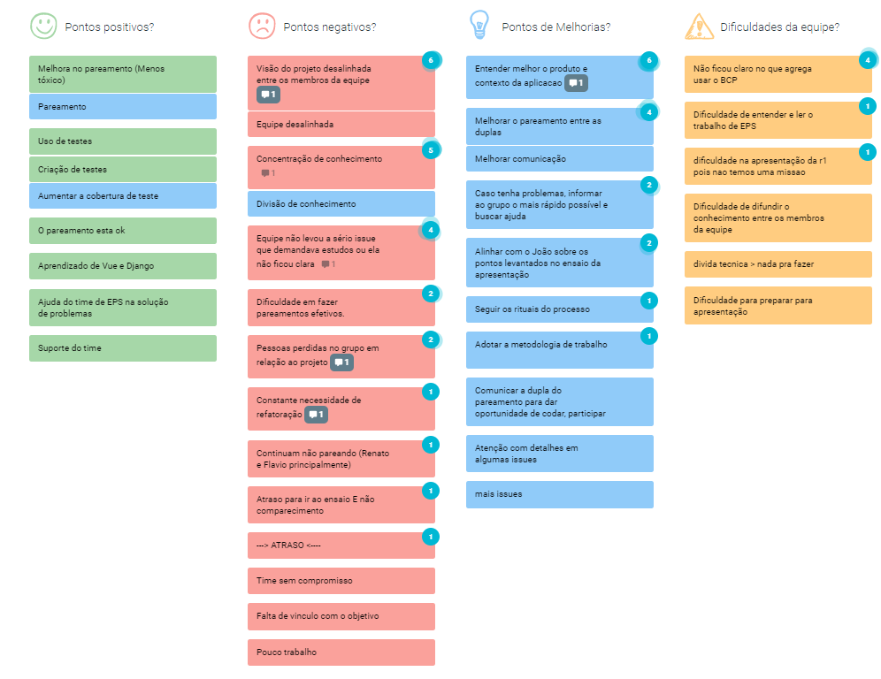
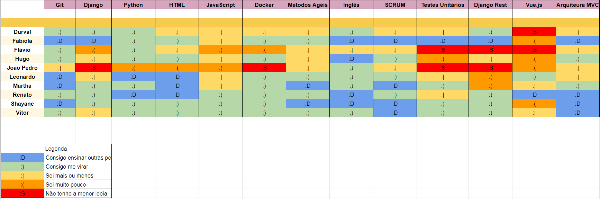
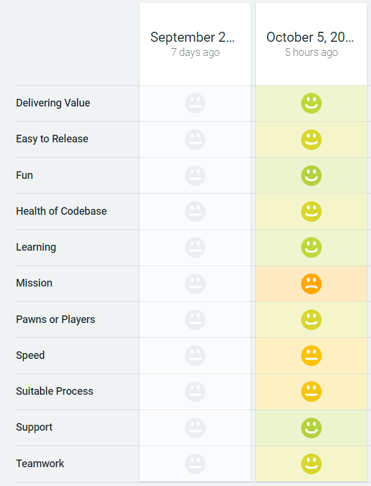

# Sprint 5

## Histórico de revisão

| Data   | Versão | Modificação  | Autor  |
| :- | :- | :- | :- |
| 05/10/2019 | 0.1 | Criação do documento |  Fabíola |
| 18/10/2019 | 0.2 | Correções e adição da análise |  Fabíola |
| 18/10/2019 | 0.3 | Adição da análise do scrum master | Shayane |

# Planning da Sprint 5

- Período : 30/09 a 05/10

- Objetivo: Melhorias de artefatos e preparação para Release 1.

## Issues

ID | Descrição | Estimativa | Label
---|-----------|------------|-------
#90 | Criar release | 3 | EPS
#89 | Refatorar Documentação de Metricas e Indicadores | 2 | EPS
#88 | Melhoria do documento de metodologia | 1 | EPS
#86 | Documentação da Sprint 4 | 5| EPS
#87 | Documentação da Sprint 3 | 5 | EPS
#92 | Refatorar documentação das sprints passadas| 3| EPS
#91 | Melhoria do github pages | 8 | EPS |
#64 | Treinar apresentação para R1 | 5 | EPS e MDS|
#93 | Refatorar requisitos no documento de visão | 5 | MDS|
#85 | Melhoria do diagrama de classes| 5 | MDS|

# Dívida alocada

ID | Descrição | Estimativa | Label
---|-----------|------------|-------
#43 | Cadastro de Usuário| 23 | MDS
#44 | Autenticação de Usuário| 20| MDS |

 - Total de pontos planejados: 42pts (mais 43 pts de dívida).
 - Total de pontos entregues: 75pts.

# Gerência de Riscos

Alguns riscos se concretizaram, a equipe não realizou ações para tentar evitá-los:
    - O conhecimento continuou concetrado;
    - Houveram problemas na configuração do ambiente, porém foram corrigidos durante a sprint;
    - A equipe ainda não tem uma visão alinhada sobre o produto;

Alguns membros tinham provas, mas mesmo assim não comprometeu o trabalho da equipe.

# Review

- Objetivo Alcançado? Sim,  equipe teve uma visão alinhada do objetivo da sprint e a maioria das histórias foram entregues.

- Estimativa correta? Sim, embora a maioria dos pontos tenham sido entregues ao final da sprint, o que pode indicar tanta a falta de trabalho constante da equipe quanto histórias muito complexas, que não estão sendo divididas em tarefas menores.

- Tarefas bem distribuidas? Alguns membros relataram que terminaram suas tarefas muito rapidamente e não tiveram mais no que trabalhar. A maioria conseguiu trabalhar em suas tarefas sem grandes problemas.

## Qualidade do Trabalho Entregue

Segundo a equipe a qualidade entregue foi de 3.85 considerando a escala de likert com os valores de 1 a 5.

## Velocity

# Retrospectiva

# Práticas ágeis

# Quadro de Conhecimento

# Squad Health Check

# Análise da Scrum Master

Esta sprint foi prioritariamente de refatoração para preparação para a Release 1. Alguns riscos se concretizaram, como dependência entre atividades, envio de PR em cima da hora e concentração do conhecimento, porém sem ação suficiente para tratá-los. Sobre a qualidade de entrega das issues, notou-se um aumento do índice. Sobre a produtividade, alguns membros se sentiram ociosos durante a semana. Pode-se aliar essa afirmação ao fato de ser uma sprint de refatoração, então o esforço não pareceu ser considerado tão alto para a equipe. Em relação a um ponto crucial que afeta a equipe, está na concentração de conhecimento e más práticas no pareamento que mostrou ser um fator de grande estresse entre os membros do grupo e ações corretivas estão sendo pensadas para contornar isso.

 

