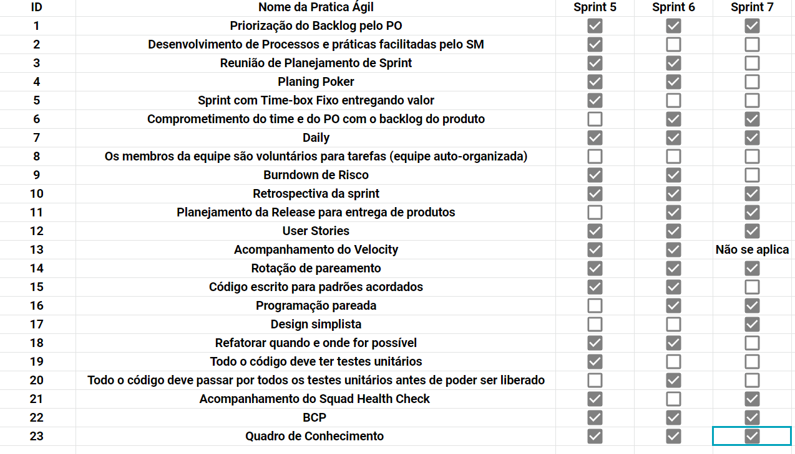

# Sprint 7

## Histórico de revisão
| Data   | Versão | Modificação  | Autor  |
| :- | :- | :- | :- |
| 19/10/2019 | 0.1 | Adição do planejamento e imagens da revisão e retrospectiva |  Fabíola |

# Planning da Sprint 6

- Período : 14/10 a 19/10

- Objetivo: Desenvolvimento do produto e automatização de processos de desenvolvimento.

## Issues

| ID | Descrição | Estimativa | Label |
| ---|-----------|------------|-------|
| #112 | Automatização das Folhas de Estilo  | 3  | EPS |
| #114 | Correção da autenticação do usuário | 2 | MDS |

# Dívidas alocadas

|ID | Descrição | Estimativa | Label|
---|-----------|------------|-------|
| #79 | Configurar ambiente de homologação | 20 | EPS |
| #105 | Documentação da Sprint 5 | 5 | EPS |
| #105 | Documentação da Sprint 6 | 5 | EPS |
| #40 | Internacionalização do produto | 8 | MDS |
| #73 | Atualizar perfil do Usuário | 38 | MDS |
| #66 | Cadastrar propriedade| 56 | MDS |

 - Total de pontos planejados: xpts (mais  pts de dívida).
 - Total de pontos entregues: ypts.

 # Possíveis riscos mapeados para a sprint

 Não mapeado!

# Review

- Objetivo Alcançado? Não. A equipe não tinha claro o objetivo da sprint e a maioria das histórias não foram entregues

- Estimativa correta? Não.

- Tarefas bem distribuidas?  Não

## Qualidade do Trabalho Entregue

Segundo a equipe a qualidade entregue foi de **3.35** considerando a escala de likert com os valores de 1 a 5.

## Velocity

# Retrospectiva

Segue imagem com todos as questões levantadas durante a retrospectiva.

# Práticas ágeis 

# Quadro de Conhecimento

# Squad Health Check

# Análise da Scrum Master

Issues não foram de fato finalizadas, mas para não virarem divida pela 2ª vez, foram fechadas e as tarefas restante mapeadas para outras issues.

