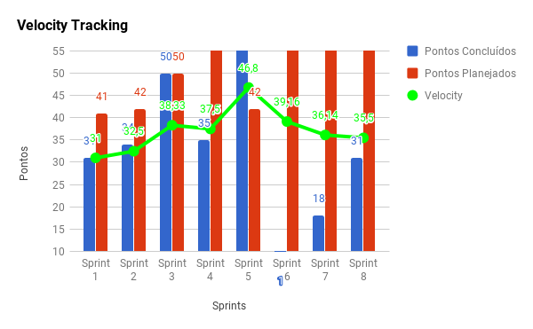
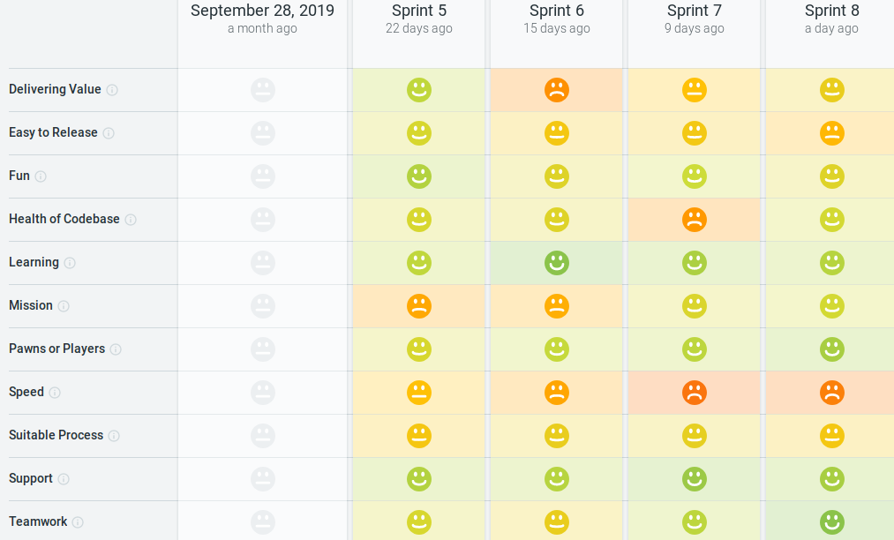

# Sprint 8

## Histórico de revisão
| Data   | Versão | Modificação  | Autor  |
| :- | :- | :- | :- |
| 28/10/2019 | 0.1 | Adição do planejamento, review, retrospectiva, health, práticas ágeis e quadro de conhecimento  |  Shayane |
| 28/10/2019 | 0.2 | Ajuste da pontuação e adição do velocity | Shayane |
| 29/10/2019 | 0.3 | Adição do burndown de riscos e análise do SM | Shayane |
<!-- docs/_sidebar.md -->
- [**Home**](home.md)
- [**Visão de Produto**](#)
    * [Termo de Abertura](project_charter.md)
    * [Estrutura Analítica do Projeto](wbs.md)
    * [Documento de Visão](vision_document.md)
    * [Documento de Arquitetura](architecture_document.md)
    * [Guia de Estilo e Identidade Visual](style_guide.md)
    * [Protótipo](prototype.md)
    * [Canvas](canvas.md)
    * [Roadmap do Produto](product_roadmap.md)

- [**Viabilidade técnica**](#)
    * [Viabilidade das tecnologias](architecture_techonologies.md)
    * [Ferramentas de testes](tools_testing.md)

- [**Gerenciamento**](#)
    * [Processo do projeto](project_methodology.md)
    * [Métricas e Indicadores](indicators_metrics.md)
    * [Sprint 0](sprints/sprint_0.md)
    * [Sprint 1](sprints/sprint_1.md)
    * [Sprint 2](sprints/sprint_2.md)
    * [Sprint 3](sprints/sprint_3.md)
    * [Sprint 4](sprints/sprint_4.md)
    * [Sprint 5](sprints/sprint_5.md)
    * [Sprint 6](sprints/sprint_6.md)

- [**Contribuição**](#)
# Planning da Sprint 8

- Período : 21/10 a 26/10

- Objetivo: Implementação de novas funcionalidades core do produto.

## Issues

| ID | Descrição | Estimativa | Label |
| ---|-----------|------------|-------|
| #126 | Atualizar o canvas do projeto | 3 | EPS |
| #124 | Configuração do github actions para preparação para o deploy contínuo no frontend  | 13 | EPS |
| #123 | Comunicação backend e frontend em ambiente de homologação | 5 | EPS |
| #121 | Configuração de variáveis de ambiente | 5 | EPS | 
| #119 | Correção de erros de análise estática | 5 | MDS |
| #116 | Visualização do dashboard do usuário | 13 | MDS |
| #67  | Cadastro de árvore    | 8 | MDS |
| #68  | Cadastro de colheita  | 8 | MDS |
| #105 | Documentação da Sprint 7 | 3 | EPS |

# Dívida alocada

ID | Descrição | Estimativa | Label|
---|-----------|------------|-------|
| #66  | Cadastrar propriedade | 56 | MDS |
| #119 | Atualizar Perfil do Usuário | 38 | MDS |

 - Total de pontos planejados: 119pts (mais 38 de issue não planejada).
 - Total de pontos entregues: 31pts.

 # Possíveis riscos mapeados para a sprint

# Review

- Objetivo Alcançado? Não. Apesar da equipe ter entendido como se daria a solução, algumas issues core não puderam ser finalizadas no time-box.

- Estimativa correta? A estimativa das issues foi realizada baseando-se na métrica adaptada de alguns tópicos. A estimativa pareceu refletir o nível de esforço entre os membros do grupo, pois eles mostraram-se mais concientes dela nas discussões. 

- Tarefas bem distribuidas? Parcialmente. Em relação às escolhas de pareamentos, o foco deu-se no nível de conhecimento entre os membros. Houve a tentativa de modificação do processo de pareamento, em relação a melhorar a autonomia de um membro da equipe, logo, foi dada a chance dele trabalhar sozinho em uma issue. Dois membros ficaram ociosos na sprint e por isso, alocaram issues de bugs conhecidos. Apesar disso, houve o rotacionamento de papéis entre MDS e EPS nos cargos de time de desenvolvimento e devops, incrementando no aprendizado mútuo. 

## Qualidade do Trabalho Entregue

Segundo a equipe a qualidade entregue foi de **3.72** considerando a escala de likert com os valores de 1 a 5.

## Velocity

# Retrospectiva

Segue imagem com todos as questões levantadas durante a retrospectiva.

# Práticas ágeis 

# Quadro de Conhecimento

# Squad Health Check

# Análise da Scrum Master

Um ponto forte da sprint foi a melhora na qualidade do código e a atualização dos critérios para um Pull request ser aceito. Além disso, a implementação de testes no frontend, com jest, começará a ser um critério para o merge. Notou-se também que, apesar de haver histórias de usuário parecidas com outras passadas, ainda há uma dificuldade de administração de conhecimento e horários durante a semana. O pareamento pareceu funcionar entre todos os membros, melhorando o compartilhamento de conhecimento. Em relação ao planejamento, houve a tentativa de aumento de autonomia de um membro, de forma voluntária, ficando com uma issue. Durante a sprint, 2 membros finalizaram sua issue e ficaram um pouco ociosos, o que influenciou a eles pegarem uma issue que não havia sido alocada sem comunicação com o PO. Ficou evidente na retrospectiva que há uma desigualdade na participação dos membros no repositório, visto que alguns têm medo de trabalhar fora de seus forks. Isso está prejudicando a dinâmica da matéria, por isso, a partir dessa sprint, está avisado fortemente a não usar os forks.  

